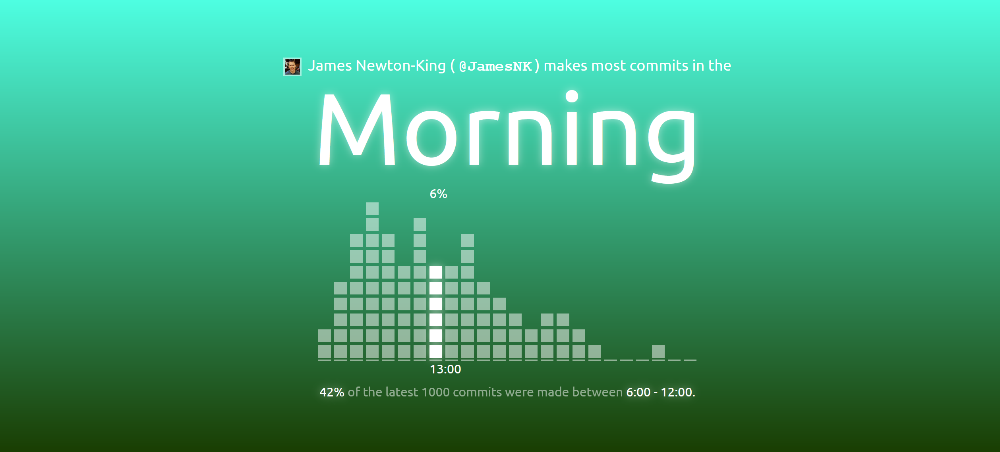
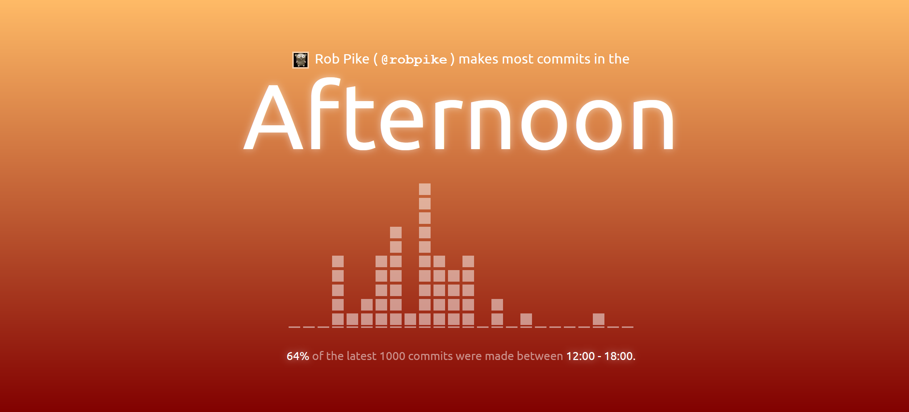
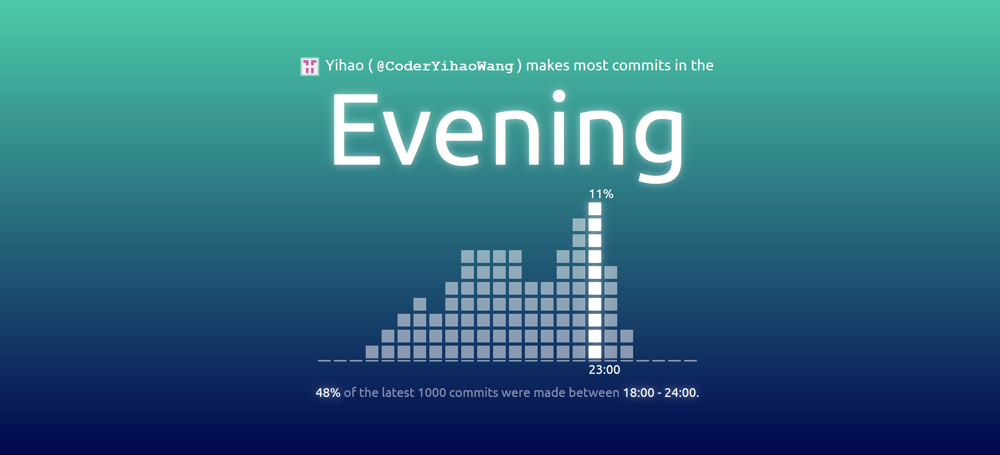
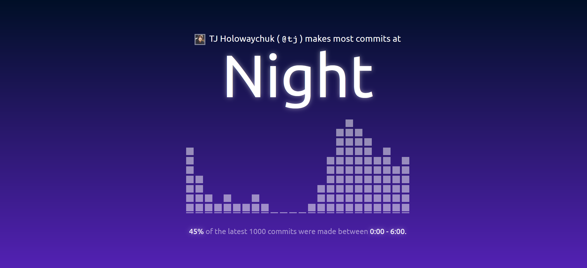

# Git Clock


Git Clock analyses your git clock type by sending requests to [GitHub's REST API](https://docs.github.com/en/rest). 

The latest up to 1000 commits with the given GitHub user id are analysed. 

The results can be in four types: `Morning` if you commit most during 6:00 - 12:00, `Afternoon` for 12:00 - 18:00, `Evening` for 18:00 - 24:00, and `Night` for 0:00 - 6:00.
The time analysed is the local time contained in the commit information.

|||
|---|---|
|||
|||

_**Note**: Due to GitHub API's [rate limiting policy](https://docs.github.com/en/rest/reference/search#rate-limit), this app can only perform 1 analysis every minute. Please wait a few moments before you want to see some other people's git clock type!_

---

The app is created with `create-react-app`.

**Develop**
```shell
npm run start
```

**Test**
```shell
npm run test
```

**Build**
```shell
npm run build
```